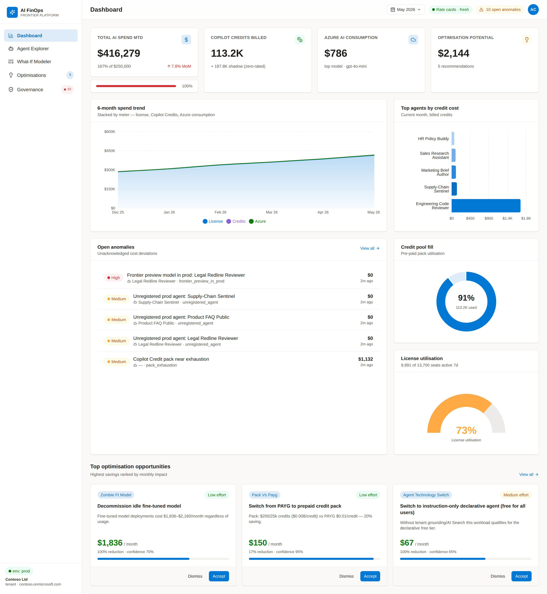
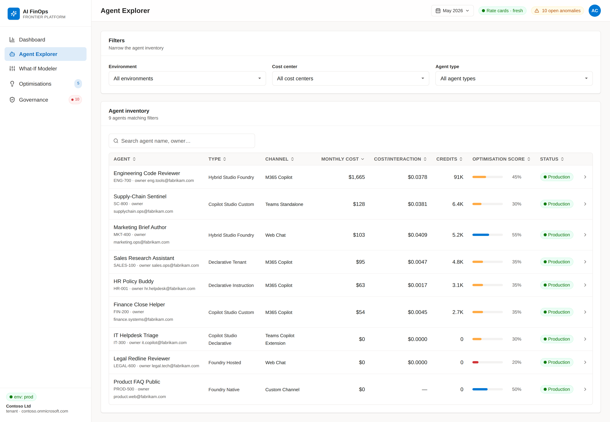
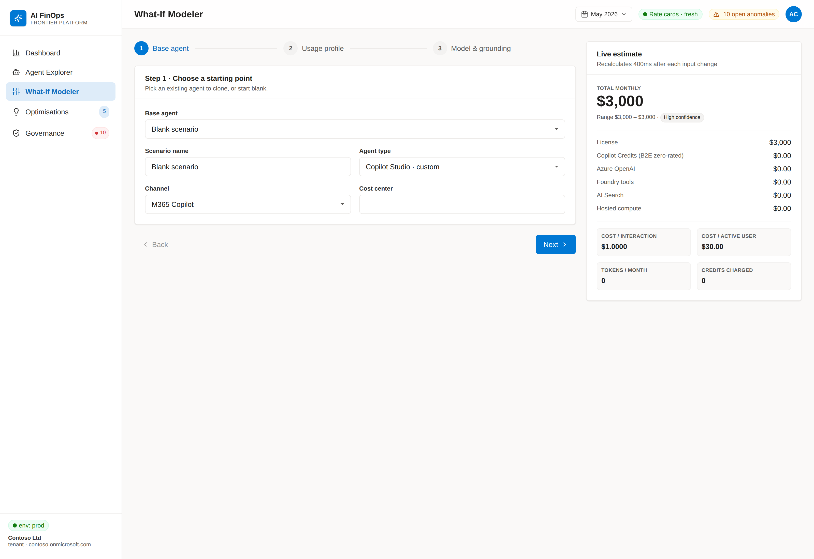
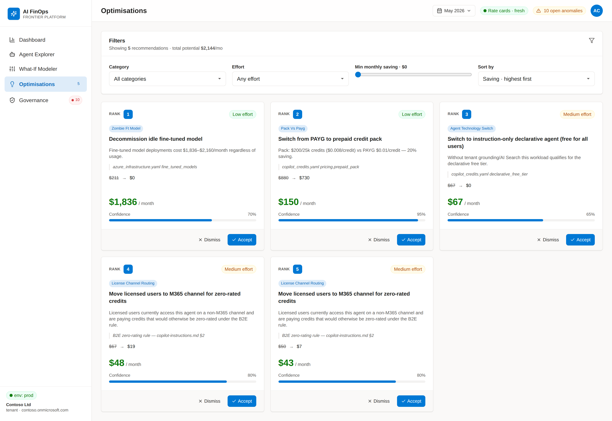
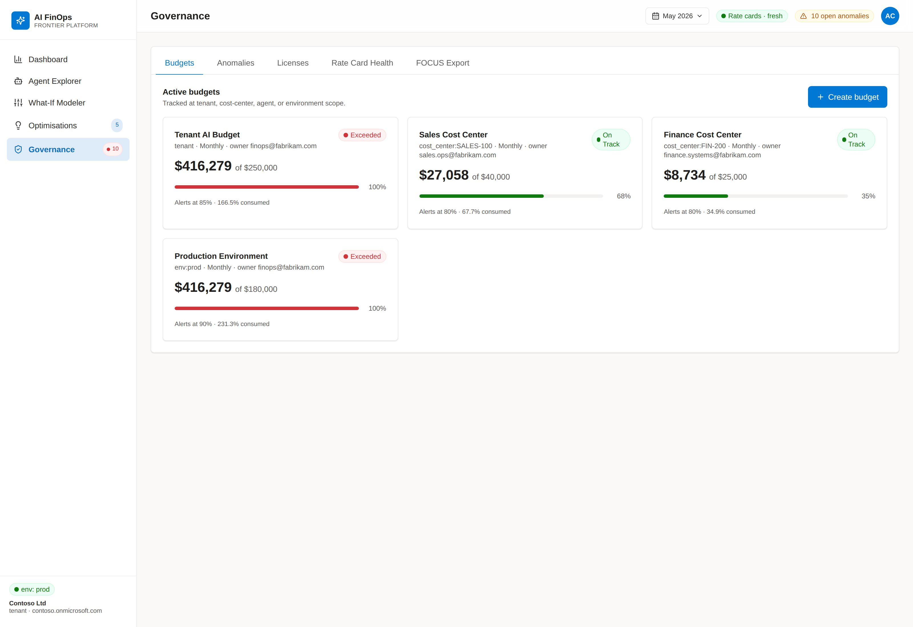

# AI FinOps

Enterprise FinOps for the **Microsoft AI Frontier Platform** —
M365 Copilot per-seat licenses, Copilot Studio Credits, and Azure OpenAI / Foundry
consumption — built per [`copilot-instructions.md`](./copilot-instructions.md).

A complete, end-to-end implementation:

* **FastAPI backend** (Python 3.11) — three-meter cost model, What-If modeller,
  11-rule optimisation recommender, hot-reloading rate-card service, and a
  SQLAlchemy 2.0 persistence layer (SQLite by default, Azure SQL via env var).
* **Real ingestion connectors** for Microsoft Graph (Copilot Credits + license SKUs),
  Azure Cost Management (FOCUS 1.1 importer with tagged/untagged splitter), and
  Azure Retail Prices (rate-card drift detector).
* **Governance** — a 10-detector anomaly engine (token spikes, zombie fine-tuned
  models, idle endpoints, untagged spend, frontier-preview-in-prod, …), budget
  CRUD with on-track/warning/exceeded statuses, and FOCUS 1.1 CSV export.
* **React 18 + TypeScript SPA** under [`web/`](./web) — Dashboard, Agent Explorer,
  What-If Modeler, **Agent Modeller** (requirement-driven seeding + decision
  engine), Optimisations, Governance, all built with Tanstack Query + Recharts
  and themed with Microsoft Fabric design tokens.
* **Plug-and-play data collection** — first-party SDK pullers for Agent 365
  (directory + usage), Entra ID (population + licensing), Microsoft Purview,
  Defender for Cloud Apps / XDR, Power Platform admin, Azure resource
  inventory, and Azure Cost Management. One auth factory
  (`MicrosoftAuthFactory` over `DefaultAzureCredential`) wires Managed
  Identity in App Service, federated workload identity in CI, and device-code
  locally. Per-source feature flags live in `.env.example`; the required
  permissions list is documented in [`docs/permissions.md`](./docs/permissions.md).
* **Single-click Azure deployment** (`scripts/deploy.sh` + `infra/main.bicep`)
  that provisions every resource in spec §12.
* **A demo seed CLI** (`python -m ai_finops.seed --reset`) that loads 9
  Fortune-500-shape agents, six months of cost history, budgets, optimisations
  and detected anomalies — used to drive both local dev and the screenshots below.

---

## Screenshots

Live screenshots from the React SPA running against the demo seed
(`python -m ai_finops.seed --reset` populates 9 agents and six months of
cost history). Captured at 1600×1100 @ 2× DPI.

### Dashboard
KPI strip (MTD spend vs. budget, credits billed + shadow, Azure consumption,
optimisation potential), 6-month stacked spend trend, top agents by credit cost,
open anomalies, credit pool fill, license utilisation gauge, and the top three
ranked optimisation recommendations.



### Agent Explorer
Filterable table of every registered agent with cost-per-interaction,
optimisation score and channel breakdown. Click a row for the slide-over
detail panel with a full cost breakdown and per-agent recommendations.



### What-If Modeler
3-step wizard (base agent → usage profile → model + grounding choices) with
a sticky live-estimate panel that re-prices on every change (debounced 400 ms),
plus a one-click scenario comparison across every agent technology.



### Optimisations
Ranked recommendation cards (license right-sizing, model down-shift, prompt
caching, batch API, channel routing, fine-tuning lifecycle, hosted-compute
resize, …) with confidence scores, before→after deltas and inline accept /
dismiss actions.



### Governance
Tabbed view of Budgets, Anomalies, Licenses, Rate Card Health and a one-click
FOCUS 1.1 CSV export.



---

## Architecture

```
                            ┌─────────────────────────┐
   Microsoft Graph API ────▶│  IngestionRunner         │──┐
   Azure Cost Mgmt FOCUS ──▶│   (graph_credits_puller, │  │
   Azure Retail Prices  ───▶│    graph_license_puller, │  │   ┌──────────────┐
   Agent 365 registry  ────▶│    azure_focus_importer) │  ├──▶│  Azure SQL    │
                            └──────────┬──────────────┘  │   │  / SQLite     │
                                       │                  │   └──────────────┘
                            ┌──────────▼──────────────┐  │   ┌──────────────┐
                            │  FastAPI backend         │──┤   │  Repository  │
   React 18 SPA  ──────────▶│  ai_finops.main:app      │  │   │  (SQLAlchemy)│
   (Vite + Tailwind +       │  • RateCardService       │  │   └──────────────┘
    Recharts +              │  • CostCalculator        │  │   ┌──────────────┐
    Tanstack Query)         │  • ScenarioComparison    │  ├──▶│  Redis Cache │
                            │  • OptimisationRecomm.   │  │   └──────────────┘
                            │  • AnomalyDetector       │  │   ┌──────────────┐
                            │  • REST API (§7)         │  └──▶│ Storage / KV │
                            └──────────────────────────┘      │ FOCUS export │
                                       │                       └──────────────┘
                                       └──▶ Application Insights + Log Analytics
```

---

## Repository layout

```
.
├── copilot-instructions.md         # Full enterprise spec (1568 lines)
├── README.md                       # This file
├── pyproject.toml / requirements.txt
├── .env.example
├── config/
│   ├── rate_cards/                 # Six YAML rate cards (per_seat, credits, OpenAI, Foundry, AI Search, infra)
│   └── allocation/split_rules.yaml
├── docs/screenshots/               # Embedded in this README
├── src/ai_finops/
│   ├── main.py                     # FastAPI app factory
│   ├── config.py                   # pydantic-settings
│   ├── seed.py                     # `python -m ai_finops.seed --reset`
│   ├── api/                        # routes + schemas (now backed by Repository)
│   ├── domain/                     # enums + dataclasses (CostEvent, AgentProfile, ...)
│   ├── db/                         # SQLAlchemy 2.0 models + Repository
│   ├── services/
│   │   ├── rate_card_service.py    # hot-reloads YAML, 7-day staleness flag
│   │   └── cost_calculator.py      # the three-meter algorithm
│   ├── modeler/scenario_comparison.py
│   ├── optimisation/recommender.py # 11 ranked savings rules
│   ├── governance/                 # 10-detector AnomalyDetector
│   └── ingestion/                  # Graph credits + license, FOCUS importer, retail prices, runner
├── web/                            # Vite + React 18 + TS SPA
│   ├── src/
│   │   ├── pages/                  # Dashboard, Agents, Modeler, Optimisations, Governance
│   │   ├── components/{ui,charts}/ # 12 primitives + 4 Recharts components
│   │   ├── hooks/                  # Tanstack Query hooks per endpoint
│   │   └── types/api.ts            # mirrors the backend schemas
│   └── tailwind.config.ts          # Microsoft Fabric design tokens
├── tests/                          # pytest — 20 tests (regression + repo + detectors + importer)
├── infra/main.bicep                # Single-file Bicep IaC for spec §12 stack
├── infra/main.parameters.json
└── scripts/deploy.sh               # Single-click Azure deploy
```

---

## Local development

### Prerequisites

* Python **3.11+**
* (Optional) Azure CLI 2.55+ if you want to deploy

### Install + run

```bash
python -m venv .venv
source .venv/bin/activate                   # Windows: .venv\Scripts\activate
pip install -e ".[dev]"

# (Optional) Seed the local SQLite DB with realistic demo data
python -m ai_finops.seed --reset

# Start the API
uvicorn ai_finops.main:app --reload
# → Swagger UI: http://localhost:8000/docs
# → Health    : http://localhost:8000/api/v1/health
```

In a second terminal, start the React SPA:

```bash
cd web
npm install
npm run dev          # http://localhost:5173 (proxies /api → :8000)
# or for a production build + preview server:
npm run build
npm run preview      # http://localhost:4173
```

### Tests + lint

```bash
pytest                          # 20 tests — regression + repo + detectors + importer
ruff check src tests            # lint
mypy src                        # optional type-check
cd web && npm run build         # frontend build (also runs tsc)
```

### Try the What-If modeller from curl

```bash
curl -X POST http://localhost:8000/api/v1/scenarios/compare \
  -H 'Content-Type: application/json' \
  -d '{
        "base_profile": {
          "agent_name": "Helpdesk",
          "channel": "m365_copilot",
          "licensed_user_count": 500,
          "unlicensed_user_count": 100,
          "avg_interactions_per_user_per_month": 50,
          "primary_model_id": "gpt_4o_mini",
          "avg_tokens_input_per_interaction": 1500,
          "avg_tokens_output_per_interaction": 400
        },
        "usage": { "generative_answers_per_interaction": 1,
                   "tenant_graph_grounding_per_interaction": 1 },
        "period_months": 1
      }' | python -m json.tool
```

---

## Single-click Azure deployment

`scripts/deploy.sh` is the one entry point. It will:

1. Validate `az` is installed and you are logged in.
2. Create the resource group `rg-<APP_NAME>-<ENV_NAME>`.
3. Validate + deploy [`infra/main.bicep`](./infra/main.bicep), provisioning:
   * App Service Plan (Linux) + App Service (FastAPI, Python 3.11)
   * Static Web App (React frontend placeholder)
   * Azure SQL Server + Database (with AAD-MSI connection string for the API)
   * Azure Functions App (Linux Python, consumption plan) for ingestion
   * Service Bus namespace + `ingestion-tasks` queue
   * Azure Cache for Redis (Basic C0)
   * Storage account + `focus-exports` and `rate-card-cache` blob containers
   * Key Vault (RBAC mode) — SQL admin password stored as a secret
   * App Configuration store
   * Application Insights + Log Analytics workspace
   * **System-assigned managed identities** on the App Service and Functions, with
     RBAC role assignments for Storage, Key Vault, App Config, Service Bus, and
     Cost Management Reader on the resource group.
4. Build a deployment zip including the backend source + rate cards.
5. `az webapp deploy` the package to the App Service (Oryx installs `requirements.txt`).
6. Restart the API and run a `/api/v1/health` smoke test.

### Run it

```bash
# Recommended: log in first, set your subscription
az login
az account set --subscription "<subscription-id>"

# Then a single command:
./scripts/deploy.sh
```

Configuration via environment variables:

| Var                    | Default                             | Notes |
|------------------------|-------------------------------------|-------|
| `APP_NAME`             | `aifinops`                          | ≤11 chars, lowercase + digits |
| `ENV_NAME`             | `dev`                               | `dev` / `test` / `prod` |
| `LOCATION`             | `eastus`                            | Any Azure region |
| `RESOURCE_GROUP`       | `rg-${APP_NAME}-${ENV_NAME}`        | Created if missing |
| `APP_PLAN_SKU`         | `B1`                                | `B1`, `B2`, `P1v3`, `P2v3` |
| `SQL_DB_SKU`           | `S0`                                | `Basic`, `S0`, `S1`, `S2`, `S3` |
| `SQL_ADMIN_LOGIN`      | `aifinopsadmin`                     | |
| `SQL_ADMIN_PASSWORD`   | *auto-generated*                    | Saved to Key Vault as `sql-admin-password` |
| `SUBSCRIPTION_ID`      | (current `az` context)              | |

Example for production:

```bash
APP_NAME=mycorpfin ENV_NAME=prod LOCATION=westeurope \
  APP_PLAN_SKU=P1v3 SQL_DB_SKU=S3 \
  SQL_ADMIN_PASSWORD='Str0ng-P@ssw0rd!' ./scripts/deploy.sh
```

### Re-deploys

The script is **idempotent** — Bicep deployments are incremental, and re-running
just pushes a new code zip. To deploy only application code without re-running
Bicep:

```bash
APP_NAME=aifinops ENV_NAME=dev ./scripts/deploy.sh    # safe — no destructive changes
```

### Required permissions

The principal running `deploy.sh` needs:

* **Contributor** on the subscription (or target resource group).
* **User Access Administrator** to create the role assignments.
* **Application Administrator** in Entra (only if you create the API app
  registration — not required for the bare backend deploy).

### Cleanup

```bash
az group delete --name rg-aifinops-dev --yes --no-wait
```

---

## API surface

All endpoints are under `/api/v1` and documented at `/docs`. The full catalogue
is in `copilot-instructions.md` §7. Highlights:

| Method | Path                                  | Purpose |
|--------|---------------------------------------|---------|
| GET    | `/api/v1/health`                      | Service health + rate-card freshness |
| GET    | `/api/v1/rate-cards`                  | Current rate card YAML payloads |
| GET    | `/api/v1/rate-cards/refresh-status`   | Loaded-at + staleness for each card |
| POST   | `/api/v1/rate-cards/reload`           | Force rate card hot-reload |
| GET    | `/api/v1/agents`                      | List agents (filter by env / cost-center / type) |
| GET    | `/api/v1/agents/{id}`                 | Agent detail with cost breakdown |
| POST   | `/api/v1/agents/{id}/estimate`        | What-If estimate for one agent |
| POST   | `/api/v1/scenarios/compare`           | Side-by-side comparison across agent technologies |
| GET    | `/api/v1/cost/{ledger,summary,trends}`| Cost ledger reads, dashboard KPIs, 6-month trend |
| GET    | `/api/v1/credits`, `/licenses`        | Credit pool + license utilisation |
| GET    | `/api/v1/optimisations`               | Ranked savings recommendations |
| POST   | `/api/v1/optimisations/{id}/dismiss`  | Dismiss with reason |
| GET    | `/api/v1/budgets`                     | Budget statuses (on_track / warning / exceeded) |
| POST   | `/api/v1/budgets`                     | Create budget (scope: tenant / cost-center / agent / env) |
| GET    | `/api/v1/anomalies`                   | Detected anomalies (10 detectors) |
| POST   | `/api/v1/anomalies/{id}/acknowledge`  | Acknowledge with action + actor |
| GET    | `/api/v1/reports/executive-summary`   | Monthly executive summary |
| GET    | `/api/v1/reports/focus-export?download=true` | Streamed FOCUS 1.1 CSV |

---

## Key design rules

These come straight from the spec and are encoded in code + tests:

1. **Three meters, never collapsed.** Per-seat, Copilot Credits, and Azure
   consumption are always reported separately. Hybrid Studio + Foundry agents
   bill on **both** Credits and Azure tokens — they are summed, never chosen
   between (see `tests/test_cost_calculator.py::test_hybrid_studio_foundry_both_meters_fire`).
2. **B2E zero-rating.** When an M365-Copilot-licensed user accesses a Copilot
   Studio agent on the M365 channel, credit cost is **$0** but **shadow credits**
   are still recorded for utilisation reporting.
3. **Declarative free tier.** Instruction-only / public-web declarative agents
   are **free for all users** (licensed and unlicensed).
4. **No hardcoded prices.** Every dollar value lives in `config/rate_cards/*.yaml`.
   The `RateCardService` flags any card whose `effective_date` is older than
   7 days.
5. **Decimal everywhere** — currency math never uses `float`.
6. **Pack-vs-PAYG with overflow.** When credits exceed 25 000/month, the
   calculator uses `floor(packs)` plus PAYG overflow, ensuring the agent never
   stops on pack exhaustion.
7. **Forward-looking pricing flagged.** Frontier preview (E7, GPT-5.4 Pro) is
   marked `confidence=low` in every breakdown.

See `copilot-instructions.md` §13 for the full guard-rail list.

---

## Roadmap

The platform is feature-complete against `copilot-instructions.md`. Natural
follow-ons (none of which block the core product):

* **Power BI semantic model** over the FOCUS 1.1 export for board-level reporting.
* **Static Web App publishing step** in `scripts/deploy.sh` to upload `web/dist`.
* **Agent 365 directory sync** (the spec calls for it, currently stubbed via the
  `agent_365_registered` field on `AgentRow`).
* **Reservation / commitment recommendations** for Azure OpenAI PTUs once
  Microsoft publishes a public retail-prices feed for them.

The Bicep template already provisions every Azure resource these features will
need (Storage, Service Bus, Functions, Static Web App, App Configuration,
Key Vault), so each can ship as a self-contained PR.

---

## License

MIT — see `copilot-instructions.md` for spec attribution to Microsoft Learn.

